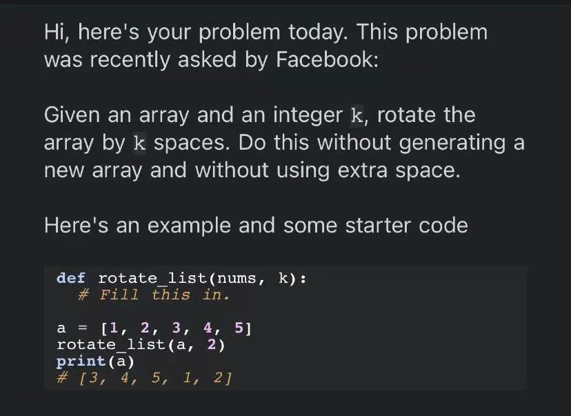

# 20210927

## my solution

>[my_solution_1 (click to view)](https://github.com/HKUST-CPEG/HKUST-CPEG.github.io/blob/master/20210927/my_solution_1.py)  

## 郑大哥版本(又赢了)

>[(click to view)](https://github.com/HKUST-CPEG/HKUST-CPEG.github.io/blob/master/20210927/0927.cpp)

## 林大哥版本

>[(click to view)](https://github.com/HKUST-CPEG/HKUST-CPEG.github.io/blob/master/20210927/rotate_array.cpp)

## today's problem

>
