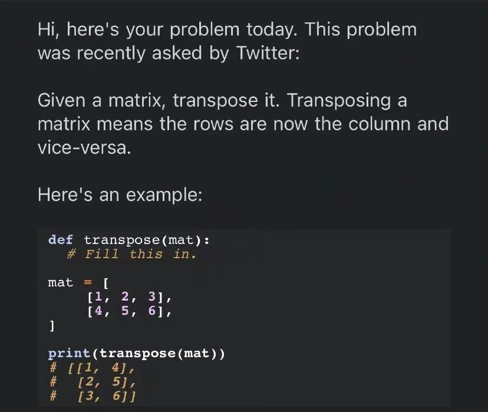

# 20210928

[<<](../README.md)

## my solution 

>[0 (随便瞎写的，引入了新list)](./my_solution_0.md)

>[1](./my_solution_1.md)  

```cpp
#include <iostream>
using namespace std;

int main()
{
    ???
    还没写完呢
}

```

## today's problem

>
