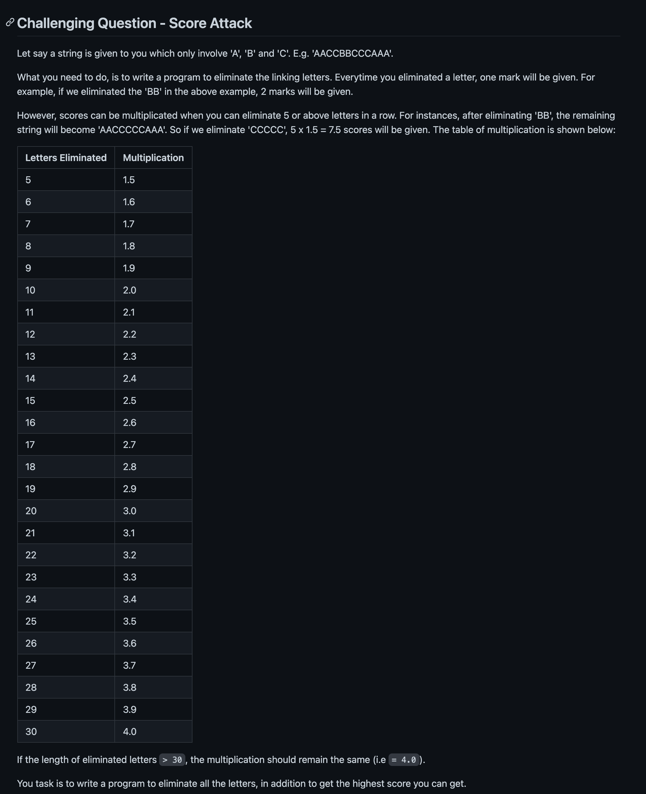

# 20211007

[<<](https://hkust-cpeg.github.io/)

## my solution

>[my_solution_0.cpp (存在一些问题，欢迎大哥指教)](./my_solution_0.md)

## 林大哥的solution

>[score_attack.c (可能不是很对)](./score_attack.md)

## today's problem

>  
>the goal is to get as high score as possible
