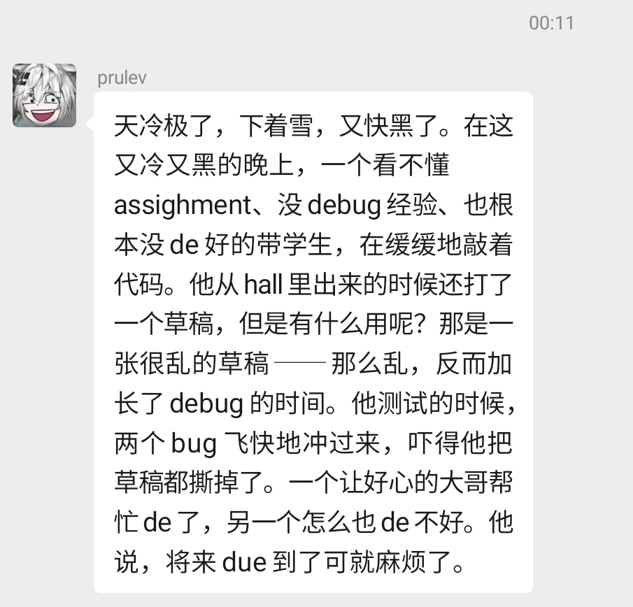
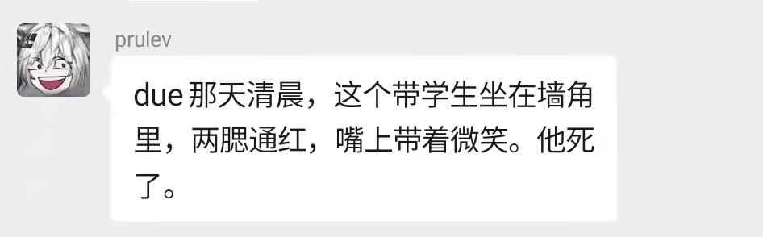

# 一些有趣题目的分享，欢迎交流讨论

## Problems

>|Date|Problem|
>|:-:|:-:|
>|2021 09 29|[click to view](./20210929/README.md)|
>|2021 09 27|[click to view](./20210927/README.md)|
>|2021 09 25|[click to view](./20210925/README.md)|
>|Earlier|[click to view](./earlier/README.md)|

## Discussions

>[讨论区](https://github.com/HKUST-CPEG/HKUST-CPEG.github.io/discussions)

>

>

>

----

test

```cpp
#include <iostream>
using namespace std;

int main()
{
   for (int i = 0; i < 3; i++)
   {
      cout << "Hello, World!" << endl;
   }

   return 0;
}


```

[wy-lang](https://wy-lang.org/)

```wy
吾有一數。曰三。名之曰「甲」。
為是「甲」遍。
    吾有一言。曰「「問天地好在。」」。書之。
云云。
```

----
感谢林总提供题目资源  
  
因本人亿点忙，更新整合可能延迟数日
